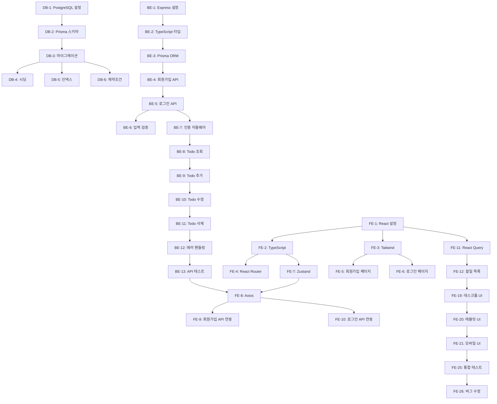

# cwh-todolist 실행계획서 (Execution Plan)

> **문서 목적**: 데이터베이스, 백엔드, 프론트엔드 개발을 위한 구체적이고 실행 가능한 작업 계획

**버전**: 1.0
**작성일**: 2025-11-26
**프로젝트**: cwh-todolist
**기반 문서**: [PRD](./3-prd.md), [ERD](./5-erd.md), [아키텍처 다이어그램](./7-arch-diagram.md)

---

## 목차

1. [실행 개요](#1-실행-개요)
2. [전체 일정 및 마일스톤](#2-전체-일정-및-마일스톤)
3. [데이터베이스 작업](#3-데이터베이스-작업)
4. [백엔드 작업](#4-백엔드-작업)
5. [프론트엔드 작업](#5-프론트엔드-작업)
6. [의존성 매트릭스](#6-의존성-매트릭스)
7. [병렬 작업 전략](#7-병렬-작업-전략)
8. [리스크 관리](#8-리스크-관리)

---

## 1. 실행 개요

### 1.1 프로젝트 목표

**cwh-todolist** MVP 개발 및 배포:
- 완전히 작동하는 웹 기반 할일 관리 애플리케이션
- 사용자 인증 (회원가입/로그인)
- Todo CRUD 기능
- Vercel 배포 (프로덕션 환경)

### 1.2 작업 분류

| 영역 | 작업 수 | 예상 소요 시간 |
|------|---------|----------------|
| 데이터베이스 | 10개 | 15시간 |
| 백엔드 | 20개 | 55시간 |
| 프론트엔드 | 28개 | 40-45시간 |
| **전체** | **58개** | **110-115시간** |

### 1.3 개발 방식

- **1인 개발** (주 10시간 기준)
- **총 개발 기간**: 약 11-12주 (3개월)
- **병렬 작업** 가능한 부분은 동시 진행
- **단계별 테스트** 및 검증

---

## 2. 전체 일정 및 마일스톤

### 2.1 주요 마일스톤

| 마일스톤 | 기간 | 주요 작업 | 완료 조건 |
|----------|------|----------|-----------|
| **M1: 기획 완료** | 1주 | 문서 검토, 환경 설정 | 모든 문서 승인, 개발 환경 구축 |
| **M2: 데이터베이스 구축** | 2주 | DB-1 ~ DB-10 | 마이그레이션 완료, 테스트 데이터 시딩 |
| **M3: 백엔드 API (인증)** | 3주 | BE-1 ~ BE-7 | 회원가입/로그인 API 완성, 테스트 통과 |
| **M4: 백엔드 API (Todo)** | 4주 | BE-8 ~ BE-13 | Todo CRUD API 완성, 통합 테스트 |
| **M5: 프론트엔드 인증** | 5주 | FE-1 ~ FE-10 | 회원가입/로그인 페이지, API 연동 |
| **M6: 프론트엔드 Todo** | 7주 | FE-11 ~ FE-18 | Todo 관리 페이지, API 연동 |
| **M7: 반응형 UI** | 8주 | FE-19 ~ FE-21 | 데스크톱/태블릿/모바일 대응 |
| **M8: 배포 및 테스트** | 10주 | BE-17, FE-23 ~ FE-26 | Vercel 배포, QA 완료 |
| **M9: MVP 출시** | 11-12주 | 문서화, 최종 검증 | 프로덕션 배포, 사용자 피드백 수집 |

### 2.2 주차별 계획

| 주차 | 데이터베이스 | 백엔드 | 프론트엔드 | 비고 |
|------|-------------|--------|-----------|------|
| 1주 | DB-1, DB-2 | BE-1, BE-2 | - | 초기 설정 병렬 |
| 2주 | DB-3 ~ DB-6 | - | - | DB 집중 개발 |
| 3주 | DB-7 ~ DB-10 | BE-3, BE-4, BE-5 | - | DB 완성, 백엔드 시작 |
| 4주 | - | BE-6, BE-7, BE-8, BE-9 | FE-1, FE-2, FE-3 | 백엔드/프론트 병렬 |
| 5주 | - | BE-10, BE-11, BE-12 | FE-4, FE-5, FE-6, FE-7 | 백엔드/프론트 병렬 |
| 6주 | - | BE-13, BE-14, BE-15 | FE-8, FE-9, FE-10 | API 연동 시작 |
| 7주 | - | BE-16, BE-17 | FE-11, FE-12, FE-13, FE-14 | 백엔드 배포, 프론트 Todo |
| 8주 | - | BE-18, BE-19 | FE-15, FE-16, FE-17, FE-18 | 문서화, Todo 완성 |
| 9주 | - | BE-20 | FE-19, FE-20, FE-21 | 반응형 UI |
| 10주 | - | - | FE-22, FE-23, FE-24 | 프론트엔드 배포 |
| 11주 | - | - | FE-25, FE-26 | 통합 테스트, 버그 수정 |
| 12주 | - | - | FE-27, FE-28 | 문서화, 최종 점검 |

---

## 3. 데이터베이스 작업

### Task DB-1: PostgreSQL 개발 환경 구성 및 Docker 설정
**설명**: Docker Compose를 통해 로컬 개발 환경에서 PostgreSQL 14 인스턴스를 구동하고, 환경 변수 및 연결 설정을 완료합니다.

**완료 조건**:
- [ ] Docker Compose 파일(docker-compose.yml) 작성
- [ ] 로컬 .env 파일에 DATABASE_URL 설정
- [ ] 로컬 PostgreSQL 인스턴스 실행 및 연결 테스트 성공
- [ ] Vercel Postgres 데이터베이스 생성 및 환경 변수 설정
- [ ] 개발/프로덕션 환경 간 데이터베이스 연결 모두 작동 확인

**의존성**: 없음
**예상 소요 시간**: 1시간
**담당 영역**: 데이터베이스

---

### Task DB-2: Prisma 초기 설정 및 스키마 작성 (MVP Phase 1)
**설명**: Prisma ORM을 프로젝트에 설치 및 구성하고, MVP 단계에 필요한 User, Todo 모델 및 Status ENUM을 정의합니다.

**완료 조건**:
- [ ] Prisma CLI 및 @prisma/client 패키지 설치
- [ ] prisma/schema.prisma 파일 작성
- [ ] User 모델 정의: id(UUID), username, email, password, createdAt, updatedAt
- [ ] Todo 모델 정의: id, userId, title, description, startDate, dueDate, status, createdAt, updatedAt
- [ ] Status ENUM 정의: ACTIVE, TRASHED
- [ ] 관계 설정: User.todos (1:N), Todo.user (N:1) with CASCADE delete
- [ ] @map 지시어로 필드명 snake_case 매핑 설정
- [ ] 초기 인덱스 정의: userId, createdAt, (userId, status) 복합 인덱스

**의존성**: DB-1
**예상 소요 시간**: 2시간
**담당 영역**: 데이터베이스

---

### Task DB-3: 초기 마이그레이션 생성 및 실행
**설명**: Prisma 스키마를 기반으로 초기 데이터베이스 마이그레이션을 생성하고, 로컬 및 프로덕션 환경에 적용합니다.

**완료 조건**:
- [ ] `npx prisma migrate dev --name init` 실행으로 초기 마이그레이션 생성
- [ ] prisma/migrations/[timestamp]_init/migration.sql 파일 검토
- [ ] 생성된 마이그레이션에 외래 키 제약(ON DELETE CASCADE) 포함 확인
- [ ] 로컬 개발 환경에 마이그레이션 적용 및 테이블 생성 확인
- [ ] Prisma Client 생성: `npx prisma generate`
- [ ] 프로덕션 환경(Vercel Postgres)에 마이그레이션 배포
- [ ] Vercel 대시보드에서 프로덕션 데이터베이스 테이블 생성 확인

**의존성**: DB-2
**예상 소요 시간**: 1.5시간
**담당 영역**: 데이터베이스

---

### Task DB-4: 초기 데이터 시딩 (테스트 데이터 및 국경일)
**설명**: MVP 테스트 및 향후 Phase 2 개발을 위해 샘플 사용자, 할일 데이터를 시딩합니다.

**완료 조건**:
- [ ] prisma/seed.ts 파일 생성
- [ ] 테스트 사용자 2명 생성: bcrypt 해시된 테스트 비밀번호 포함
- [ ] 테스트 사용자별 할일 데이터 4~5개 생성
- [ ] package.json에 "prisma.seed" 설정 추가
- [ ] `npx prisma db seed` 실행으로 로컬 환경 시딩
- [ ] 시딩 완료 후 데이터 검증
- [ ] Phase 2 대비: 시딩 스크립트에 국경일 데이터 추가 가능하도록 구조 준비

**의존성**: DB-3
**예상 소요 시간**: 1.5시간
**담당 영역**: 데이터베이스

---

### Task DB-5: 필수 인덱스 검증 및 최적화
**설명**: 마이그레이션에서 자동 생성된 인덱스와 추가 필요한 인덱스를 검증하고, 데이터베이스 쿼리 성능 최적화를 위해 필요한 인덱스를 추가합니다.

**완료 조건**:
- [ ] users 테이블 인덱스 확인: PRIMARY KEY, UNIQUE INDEX (username, email)
- [ ] todos 테이블 인덱스 확인: PRIMARY KEY, INDEX (userId, createdAt), COMPOSITE INDEX (userId, status)
- [ ] 인덱스 목록 조회 및 확인
- [ ] 필요 시 인덱스 생성 마이그레이션 추가
- [ ] EXPLAIN ANALYZE로 주요 쿼리 성능 계획 검증

**의존성**: DB-3
**예상 소요 시간**: 1.5시간
**담당 영역**: 데이터베이스

---

### Task DB-6: 데이터 검증 및 제약 조건 구현
**설명**: 애플리케이션 레벨의 비즈니스 규칙 및 데이터 길이 제약을 구현합니다.

**완료 조건**:
- [ ] Prisma 스키마 업데이트: 데이터 타입 및 길이 제약 확인
- [ ] PostgreSQL CHECK 제약 생성 마이그레이션 추가(선택)
- [ ] 마이그레이션 생성 및 적용
- [ ] 애플리케이션 레벨 검증 규칙 문서화
- [ ] 제약 조건 위반 테스트

**의존성**: DB-3, DB-5
**예상 소요 시간**: 1.5시간
**담당 영역**: 데이터베이스

---

### Task DB-7: Phase 2 PublicTodo 모델 및 마이그레이션 준비
**설명**: MVP 출시 후 Phase 2에서 구현할 공통 할일(국경일 등) 기능을 위해 PublicTodo 모델과 마이그레이션을 미리 정의합니다.

**완료 조건**:
- [ ] Prisma 스키마에 PublicTodo 모델 추가
- [ ] PublicTodo 인덱스 정의
- [ ] Phase 2 마이그레이션 파일 사전 생성
- [ ] 마이그레이션 파일 검토 및 저장
- [ ] Phase 2 시작 전 체크리스트에 "마이그레이션 배포" 항목 추가

**의존성**: DB-2
**예상 소요 시간**: 1시간
**담당 영역**: 데이터베이스

---

### Task DB-8: 백업 및 복구 전략 구현
**설명**: 프로덕션 데이터 안정성을 위해 자동 백업, 수동 백업 절차, 그리고 복구 전략을 수립합니다.

**완료 조건**:
- [ ] Vercel Postgres 자동 백업 설정 확인
- [ ] 로컬 개발 환경용 수동 백업 스크립트 작성
- [ ] 백업 저장 경로 설정
- [ ] 백업 및 복구 절차 문서화
- [ ] 테스트: 백업 파일 생성 후 로컬 데이터베이스에서 복구 테스트
- [ ] 프로덕션 긴급 복구 절차 문서화
- [ ] .gitignore에 백업 파일 패턴 추가

**의존성**: DB-1
**예상 소요 시간**: 1.5시간
**담당 영역**: 데이터베이스

---

### Task DB-9: 데이터베이스 마이그레이션 히스토리 관리 및 롤백 전략 수립
**설명**: 향후 데이터베이스 스키마 변경 시를 대비하여 마이그레이션 버전 관리 및 롤백 전략을 정의합니다.

**완료 조건**:
- [ ] prisma/migrations/ 디렉토리 구조 확인 및 마이그레이션 명명 규칙 정의
- [ ] 마이그레이션 상태 확인 명령어 문서화
- [ ] 롤백 전략 수립 및 롤백 SQL 템플릿 작성
- [ ] 롤백 테스트 절차 문서화
- [ ] 마이그레이션 히스토리 추적 문서 작성
- [ ] 팀/향후 개발자를 위한 마이그레이션 작성 가이드 문서화

**의존성**: DB-3
**예상 소요 시간**: 1.5시간
**담당 영역**: 데이터베이스

---

### Task DB-10: 데이터베이스 문서화 및 성능 모니터링 설정
**설명**: 데이터베이스 스키마, 쿼리 최적화, 성능 모니터링을 위한 문서 및 도구를 준비합니다.

**완료 조건**:
- [ ] docs/DATABASE.md 파일 작성
- [ ] Prisma Studio 사용 가이드
- [ ] PostgreSQL 느린 쿼리 로깅 설정
- [ ] 성능 벤치마크 계획
- [ ] 개발팀 온보딩 체크리스트에 "DATABASE.md 읽기" 항목 추가

**의존성**: DB-1~DB-9
**예상 소요 시간**: 2시간
**담당 영역**: 데이터베이스

---

## 4. 백엔드 작업

### Task BE-1: Express.js 프로젝트 초기 설정
**설명**: Node.js v20 LTS 환경에서 Express.js 백엔드 프로젝트 초기화, TypeScript 설정, 프로젝트 디렉토리 구조 구성

**완료 조건**:
- [ ] Node.js v20 LTS 설치 및 확인
- [ ] package.json 생성
- [ ] TypeScript 및 ts-node 설치
- [ ] Express.js 설치
- [ ] tsconfig.json 파일 생성 및 strict mode 활성화
- [ ] 프로젝트 디렉토리 구조 생성
- [ ] ESLint + Prettier 설정파일 생성
- [ ] 기본 Express 앱 생성
- [ ] 개발 서버 실행 가능 확인
- [ ] 환경 변수 로드를 위한 dotenv 설치 및 설정

**의존성**: 없음
**예상 소요 시간**: 2시간
**담당 영역**: 백엔드

---

### Task BE-2: TypeScript 설정 및 타입 정의
**설명**: 프로젝트 전체에서 사용할 TypeScript 타입 정의 파일 작성

**완료 조건**:
- [ ] `src/types/` 디렉토리 생성
- [ ] User, Todo, PublicTodo 엔티티 타입 정의
- [ ] API 요청 DTO 타입 정의
- [ ] API 응답 DTO 타입 정의
- [ ] 에러 타입 정의
- [ ] JWT Payload 타입 정의
- [ ] 공통 유틸리티 타입 정의
- [ ] 모든 타입 파일이 컴파일 오류 없이 로드됨 확인

**의존성**: BE-1
**예상 소요 시간**: 3시간
**담당 영역**: 백엔드

---

### Task BE-3: 데이터베이스 설정 및 Prisma ORM 구성
**설명**: Vercel Postgres 또는 로컬 PostgreSQL 데이터베이스 연결, Prisma ORM 설치 및 초기화

**완료 조건**:
- [ ] Prisma 설치
- [ ] .env 파일에 DATABASE_URL 설정
- [ ] prisma/schema.prisma 파일 생성 및 데이터베이스 설정
- [ ] User 모델 정의
- [ ] Todo 모델 정의
- [ ] PublicTodo 모델 정의 (Phase 2용)
- [ ] Prisma 마이그레이션 실행
- [ ] Prisma 클라이언트 싱글톤 패턴 구현
- [ ] Prisma Studio에서 테이블 생성 확인

**의존성**: BE-1
**예상 소요 시간**: 4시간
**담당 영역**: 백엔드

---

### Task BE-4: 회원가입 API 개발 (F-AUTH-001)
**설명**: Express.js 라우트에서 새 사용자 계정 생성 API 개발

**완료 조건**:
- [ ] bcrypt 패키지 설치
- [ ] authController.ts 생성
- [ ] signup 함수 구현
- [ ] 에러 처리 (중복 username/email, 검증 실패, 서버 오류)
- [ ] authRoutes.ts 생성
- [ ] POST /api/auth/signup 라우트 연결
- [ ] Express 앱에 라우터 등록
- [ ] Postman/Thunder Client에서 API 테스트

**의존성**: BE-2, BE-3
**예상 소요 시간**: 4시간
**담당 영역**: 백엔드

---

### Task BE-5: 로그인 API 개발 (F-AUTH-002)
**설명**: 사용자 인증 API 개발, 비밀번호 검증, JWT 토큰 발급

**완료 조건**:
- [ ] jsonwebtoken 패키지 설치
- [ ] JWT 유틸리티 함수 생성
- [ ] .env에 JWT 환경 변수 추가
- [ ] login 함수 구현
- [ ] POST /api/auth/login 라우트 연결
- [ ] Postman/Thunder Client에서 테스트

**의존성**: BE-4
**예상 소요 시간**: 3시간
**담당 영역**: 백엔드

---

### Task BE-6: 입력 검증 미들웨어 및 express-validator 통합
**설명**: express-validator를 사용한 요청 입력값 검증

**완료 조건**:
- [ ] express-validator 설치
- [ ] validators.ts 생성
- [ ] 사용자 정보 검증 규칙 정의
- [ ] 할일 정보 검증 규칙 정의
- [ ] 검증 함수 생성
- [ ] 검증 에러 처리 미들웨어 생성
- [ ] 라우트에 검증 미들웨어 연결
- [ ] Postman에서 검증 실패 케이스 테스트

**의존성**: BE-4, BE-5
**예상 소요 시간**: 3시간
**담당 영역**: 백엔드

---

### Task BE-7: 인증 미들웨어 개발
**설명**: JWT 토큰 검증 미들웨어 개발

**완료 조건**:
- [ ] authMiddleware.ts 생성
- [ ] authenticate 함수 구현
- [ ] 에러 처리
- [ ] 미들웨어를 보호된 라우트에 적용 가능하도록 설정
- [ ] 테스트 (유효한 토큰, 만료된 토큰, 토큰 없음)

**의존성**: BE-5
**예상 소요 시간**: 2시간
**담당 영역**: 백엔드

---

### Task BE-8: Todo 조회 API 개발 (F-TODO-001)
**설명**: 로그인한 사용자의 활성 할일 목록 조회 API 개발

**완료 조건**:
- [ ] todoController.ts 생성
- [ ] getTodos 함수 구현
- [ ] todoRoutes.ts 생성
- [ ] GET /api/todos 라우트 생성
- [ ] 인증 미들웨어로 라우트 보호
- [ ] 테스트

**의존성**: BE-3, BE-7
**예상 소요 시간**: 3시간
**담당 영역**: 백엔드

---

### Task BE-9: Todo 추가 API 개발 (F-TODO-002)
**설명**: 새로운 할일 생성 API 개발

**완료 조건**:
- [ ] createTodo 함수 구현
- [ ] validateCreateTodo 검증 규칙 적용
- [ ] POST /api/todos 라우트 생성
- [ ] 인증 미들웨어로 라우트 보호
- [ ] 테스트

**의존성**: BE-8, BE-6
**예상 소요 시간**: 3시간
**담당 영역**: 백엔드

---

### Task BE-10: Todo 수정 API 개발 (F-TODO-003)
**설명**: 기존 할일의 내용 및 일정 수정 API 개발

**완료 조건**:
- [ ] updateTodo 함수 구현
- [ ] validateUpdateTodo 검증 규칙 적용
- [ ] PUT /api/todos/:id 라우트 생성
- [ ] 인증 미들웨어로 라우트 보호
- [ ] 테스트

**의존성**: BE-9
**예상 소요 시간**: 3시간
**담당 영역**: 백엔드

---

### Task BE-11: Todo 삭제 API 개발 (F-TODO-004 - MVP 버전)
**설명**: 할일 삭제 API 개발 (MVP에서는 즉시 삭제)

**완료 조건**:
- [ ] deleteTodo 함수 구현
- [ ] DELETE /api/todos/:id 라우트 생성
- [ ] 인증 미들웨어로 라우트 보호
- [ ] 테스트

**의존성**: BE-10
**예상 소요 시간**: 2시간
**담당 영역**: 백엔드

---

### Task BE-12: 에러 핸들링 미들웨어 및 공통 에러 처리
**설명**: 전역 에러 핸들링 미들웨어 개발

**완료 조건**:
- [ ] errorHandler.ts 생성
- [ ] 에러 응답 형식 정의
- [ ] 에러 코드 정의
- [ ] 글로벌 에러 핸들러 미들웨어 구현
- [ ] 404 핸들러
- [ ] Express 앱에 미들웨어 등록
- [ ] 테스트

**의존성**: BE-11
**예상 소요 시간**: 2시간
**담당 영역**: 백엔드

---

### Task BE-13: API 테스트 (Postman/Thunder Client)
**설명**: 모든 API 엔드포인트에 대한 통합 테스트

**완료 조건**:
- [ ] Postman 또는 Thunder Client 컬렉션 생성
- [ ] 회원가입 API 테스트
- [ ] 로그인 API 테스트
- [ ] 할일 조회 API 테스트
- [ ] 할일 추가 API 테스트
- [ ] 할일 수정 API 테스트
- [ ] 할일 삭제 API 테스트
- [ ] 테스트 결과 문서화
- [ ] API 응답 시간 측정

**의존성**: BE-12
**예상 소요 시간**: 4시간
**담당 영역**: 백엔드

---

### Task BE-14: CORS 설정 및 보안 미들웨어
**설명**: CORS 설정으로 프론트엔드 요청 허용

**완료 조건**:
- [ ] cors 패키지 설치
- [ ] CORS 미들웨어 생성 및 설정
- [ ] Express 앱에 CORS 미들웨어 등록
- [ ] 보안 헤더 설정
- [ ] 요청 크기 제한
- [ ] 테스트

**의존성**: BE-14 이전 모든 작업
**예상 소요 시간**: 2시간
**담당 영역**: 백엔드

---

### Task BE-15: 환경 변수 관리 및 설정 파일
**설명**: 프로덕션 및 개발 환경에 따른 환경 변수 관리

**완료 조건**:
- [ ] .env.example 파일 생성
- [ ] environment.ts 생성
- [ ] 개발 환경 (.env) 설정
- [ ] 프로덕션 환경 (Vercel) 준비
- [ ] 환경 변수 로드
- [ ] 테스트

**의존성**: BE-1
**예상 소요 시간**: 1시간
**담당 영역**: 백엔드

---

### Task BE-16: 로깅 설정 및 헬스 체크 엔드포인트
**설명**: 서버 로깅 설정, 헬스 체크 엔드포인트 구현

**완료 조건**:
- [ ] logger.ts 생성
- [ ] 로그 레벨 설정
- [ ] GET /api/health 엔드포인트 구현
- [ ] healthRoutes.ts 생성
- [ ] 테스트

**의존성**: BE-14
**예상 소요 시간**: 2시간
**담당 영역**: 백엔드

---

### Task BE-17: Vercel 배포 설정
**설명**: Vercel Serverless Functions를 위한 백엔드 배포 설정

**완료 조건**:
- [ ] vercel.json 파일 생성
- [ ] package.json에 build 스크립트 추가
- [ ] .gitignore 파일 확인
- [ ] GitHub 저장소 연결 (선택사항)
- [ ] Vercel에서 프로젝트 생성
- [ ] 로컬에서 vercel dev로 테스트
- [ ] 배포 문서 작성

**의존성**: BE-16
**예상 소요 시간**: 3시간
**담당 영역**: 백엔드

---

### Task BE-18: 백엔드 API 문서화
**설명**: API 엔드포인트 명세서 작성

**완료 조건**:
- [ ] docs/API.md 파일 생성
- [ ] API 개요 작성
- [ ] 각 엔드포인트 문서 작성
- [ ] 에러 코드 목록
- [ ] 데이터 모델 정의
- [ ] Postman/Thunder Client 컬렉션 JSON 내보내기

**의존성**: BE-13
**예상 소요 시간**: 3시간
**담당 영역**: 백엔드

---

### Task BE-19: 보안 강화 및 입력 살균 (Sanitization)
**설명**: XSS 방지, SQL Injection 방지, 입력값 살균

**완료 조건**:
- [ ] express-validator로 기본 입력 검증
- [ ] 특수문자 처리
- [ ] 비밀번호 보안
- [ ] JWT 토큰 보안
- [ ] 검증 및 테스트

**의존성**: BE-19 이전 모든 보안 작업
**예상 소요 시간**: 2시간
**담당 영역**: 백엔드

---

### Task BE-20: README 및 개발 가이드 문서 작성
**설명**: 프로젝트 설정 및 실행 방법, 개발 가이드 문서 작성

**완료 조건**:
- [ ] README.md 작성
- [ ] docs/DEVELOPMENT.md 작성 (선택)
- [ ] 라이센스 파일 (LICENSE)
- [ ] .gitignore 확인

**의존성**: BE-18
**예상 소요 시간**: 2시간
**담당 영역**: 백엔드

---

## 5. 프론트엔드 작업

### Task FE-1: React + Vite 프로젝트 초기 설정
**설명**: Vite를 사용하여 React 프로젝트를 초기화하고, 기본 프로젝트 구조를 설정합니다.

**완료 조건**:
- [ ] React + TypeScript + Vite 프로젝트 생성
- [ ] Node.js v20 LTS 설치 및 확인
- [ ] 기본 의존성 설치
- [ ] 프로젝트 폴더 구조 생성
- [ ] 개발 서버 정상 작동 확인
- [ ] .gitignore 파일 설정
- [ ] package.json 스크립트 설정
- [ ] README.md 기본 작성

**의존성**: 없음
**예상 소요 시간**: 1시간
**담당 영역**: 프론트엔드

---

### Task FE-2: TypeScript 설정 및 타입 정의
**설명**: TypeScript strict 모드를 활성화하고, 프로젝트에 필요한 전역 타입 정의파일을 작성합니다.

**완료 조건**:
- [ ] tsconfig.json에서 strict mode 설정
- [ ] src/types/ 폴더 생성
- [ ] 전역 타입 정의 작성
- [ ] API 에러 타입 정의
- [ ] 페이지 컴포넌트 Props 타입 정의
- [ ] TypeScript 컴파일 에러 없음 확인

**의존성**: FE-1
**예상 소요 시간**: 1.5시간
**담당 영역**: 프론트엔드

---

### Task FE-3: Tailwind CSS 설정
**설명**: Tailwind CSS를 프로젝트에 설치하고 설정합니다.

**완료 조건**:
- [ ] Tailwind CSS 설치
- [ ] tailwind.config.js, postcss.config.js 생성
- [ ] content 경로 설정
- [ ] 커스텀 색상 정의
- [ ] 커스텀 폰트 설정
- [ ] Tailwind 디렉티브 추가
- [ ] 전역 스타일 정의
- [ ] CSS 정상 번들링 확인

**의존성**: FE-1
**예상 소요 시간**: 1.5시간
**담당 영역**: 프론트엔드

---

### Task FE-4: React Router 설정
**설명**: React Router v6를 프로젝트에 설치하고, 라우팅 구조를 설정합니다.

**완료 조건**:
- [ ] react-router-dom 설치
- [ ] 라우터 설정
- [ ] 라우트 정의
- [ ] ProtectedRoute 컴포넌트 구현
- [ ] 라우트 변경 시 리다이렉트 처리
- [ ] 404 Not Found 페이지 추가
- [ ] 라우팅 정상 작동 확인

**의존성**: FE-1, FE-2
**예상 소요 시간**: 2시간
**담당 영역**: 프론트엔드

---

### Task FE-5: 회원가입 페이지 구현
**설명**: 회원가입 페이지를 구현합니다.

**완료 조건**:
- [ ] SignupPage.tsx 컴포넌트 생성
- [ ] 폼 레이아웃 구성
- [ ] Tailwind CSS 스타일 적용
- [ ] 클라이언트 측 입력값 검증 구현
- [ ] 폼 제출 처리
- [ ] 에러 메시지 표시
- [ ] 로그인 페이지 링크
- [ ] 로딩 중 상태 표시
- [ ] 반응형 확인

**의존성**: FE-3, FE-4
**예상 소요 시간**: 2.5시간
**담당 영역**: 프론트엔드

---

### Task FE-6: 로그인 페이지 구현
**설명**: 로그인 페이지를 구현합니다.

**완료 조건**:
- [ ] LoginPage.tsx 컴포넌트 생성
- [ ] 폼 레이아웃 구성
- [ ] Tailwind CSS 스타일 적용
- [ ] 클라이언트 측 입력값 검증
- [ ] 폼 제출 처리
- [ ] 에러 메시지 표시
- [ ] 회원가입 페이지 링크
- [ ] 로딩 중 상태 표시
- [ ] 반응형 확인

**의존성**: FE-3, FE-4
**예상 소요 시간**: 2.5시간
**담당 영역**: 프론트엔드

---

### Task FE-7: 인증 상태 관리 (Zustand)
**설명**: Zustand를 사용하여 글로벌 인증 상태를 관리합니다.

**완료 조건**:
- [ ] Zustand 설치
- [ ] authStore.ts 생성
- [ ] Zustand 스토어 정의
- [ ] LocalStorage 토큰 저장/로드 기능 구현
- [ ] 페이지 새로고침 시 토큰 자동 로드
- [ ] TypeScript 타입 안전성 확인
- [ ] 스토어 사용 예제 작성

**의존성**: FE-2
**예상 소요 시간**: 2시간
**담당 영역**: 프론트엔드

---

### Task FE-8: Axios 설정 및 API 클라이언트
**설명**: Axios를 설정하여 API 통신을 구현합니다.

**완료 조건**:
- [ ] Axios 설치
- [ ] axiosInstance.ts 생성
- [ ] 인증 관련 API 함수 정의
- [ ] 할일 관련 API 함수 정의
- [ ] 에러 처리 유틸리티 작성
- [ ] API 함수 타입 안전성 확인

**의존성**: FE-2, FE-7
**예상 소요 시간**: 2시간
**담당 영역**: 프론트엔드

---

### Task FE-9: 회원가입 API 연동
**설명**: 회원가입 페이지를 API와 연결합니다.

**완료 조건**:
- [ ] 회원가입 페이지 수정
- [ ] signup 함수 호출
- [ ] API 응답 성공 시 처리
- [ ] API 응답 실패 시 처리
- [ ] 네트워크 요청 중 로딩 상태 관리
- [ ] 폼 초기화 처리
- [ ] 에러 로그 확인

**의존성**: FE-5, FE-8
**예상 소요 시간**: 1.5시간
**담당 영역**: 프론트엔드

---

### Task FE-10: 로그인 API 연동
**설명**: 로그인 페이지를 API와 연결합니다.

**완료 조건**:
- [ ] 로그인 페이지 수정
- [ ] login 함수 호출
- [ ] API 응답 성공 시 처리
- [ ] API 응답 실패 시 처리
- [ ] 네트워크 요청 중 로딩 상태 관리
- [ ] 폼 초기화 처리

**의존성**: FE-6, FE-8
**예상 소요 시간**: 1.5시간
**담당 영역**: 프론트엔드

---

### Task FE-11: React Query 설정
**설명**: React Query (TanStack Query)를 설치하고 설정합니다.

**완료 조건**:
- [ ] React Query 설치
- [ ] QueryClient 생성
- [ ] QueryClientProvider로 앱 감싸기
- [ ] React Query DevTools 설치 및 설정

**의존성**: FE-1
**예상 소요 시간**: 1시간
**담당 영역**: 프론트엔드

---

### Task FE-12: 할일 목록 페이지 구현 (API 연동)
**설명**: 할일 목록 페이지를 구현하고 React Query를 사용하여 API와 연동합니다.

**완료 조건**:
- [ ] TodosPage.tsx 컴포넌트 생성
- [ ] 레이아웃 구성
- [ ] useQuery 훅으로 할일 목록 조회
- [ ] 로딩 상태 표시
- [ ] 에러 상태 표시
- [ ] 빈 상태 메시지 표시
- [ ] 할일 카드 컴포넌트 구현
- [ ] 반응형 스타일
- [ ] 날짜순 정렬 확인

**의존성**: FE-8, FE-11
**예상 소요 시간**: 3시간
**담당 영역**: 프론트엔드

---

### Task FE-13: 할일 추가 모달/폼 구현
**설명**: 할일을 추가하기 위한 모달 또는 폼을 구현합니다.

**완료 조건**:
- [ ] TodoModal.tsx 또는 TodoForm.tsx 컴포넌트 생성
- [ ] 폼 필드 구성
- [ ] 입력값 검증
- [ ] 저장/취소 버튼
- [ ] 모달/폼 스타일
- [ ] 모달 열기/닫기 상태 관리
- [ ] 모달 배경 클릭 시 닫기

**의존성**: FE-3
**예상 소요 시간**: 2.5시간
**담당 영역**: 프론트엔드

---

### Task FE-14: 할일 추가 API 연동
**설명**: 할일 추가 모달을 API와 연동합니다.

**완료 조건**:
- [ ] 모달에 API 호출 추가
- [ ] useMutation 훅 사용
- [ ] 로딩 중 버튼 비활성화
- [ ] 성공 시 모달 자동 닫기 및 폼 초기화
- [ ] 낙관적 업데이트 구현 (선택사항)
- [ ] 에러 메시지 표시

**의존성**: FE-8, FE-13
**예상 소요 시간**: 1.5시간
**담당 영역**: 프론트엔드

---

### Task FE-15: 할일 수정 모달/폼 구현
**설명**: 할일 수정을 위한 모달/폼을 구현합니다.

**완료 조건**:
- [ ] TodoEditModal.tsx 또는 기존 TodoModal 컴포넌트 수정
- [ ] 할일 ID를 props로 받아서 기존 데이터 로드
- [ ] 폼 필드에 기존 값 미리 채우기
- [ ] FE-13과 동일한 필드 구성
- [ ] 저장/취소 버튼
- [ ] 입력값 변경 감지
- [ ] Tailwind CSS 스타일 적용

**의존성**: FE-3, FE-13
**예상 소요 시간**: 1.5시간
**담당 영역**: 프론트엔드

---

### Task FE-16: 할일 수정 API 연동
**설명**: 할일 수정 모달을 API와 연동합니다.

**완료 조건**:
- [ ] 모달에 API 호출 추가
- [ ] useMutation 훅 사용
- [ ] 로딩 중 버튼 비활성화
- [ ] 성공 시 모달 자동 닫기
- [ ] 변경사항이 없으면 제출 불가능 (선택사항)
- [ ] 에러 메시지 표시

**의존성**: FE-8, FE-15
**예상 소요 시간**: 1.5시간
**담당 영역**: 프론트엔드

---

### Task FE-17: 할일 삭제 확인 다이얼로그
**설명**: 할일 삭제 전 확인 다이얼로그를 구현합니다.

**완료 조건**:
- [ ] ConfirmDialog.tsx 또는 DeleteConfirmModal.tsx 컴포넌트 생성
- [ ] 다이얼로그 구성
- [ ] 다이얼로그 열기/닫기 상태 관리
- [ ] 배경 클릭 또는 취소 버튼으로 닫기
- [ ] Tailwind CSS 스타일
- [ ] 삭제할 할일 ID를 props로 받기
- [ ] onConfirm 콜백 함수 제공

**의존성**: FE-3
**예상 소요 시간**: 1.5시간
**담당 영역**: 프론트엔드

---

### Task FE-18: 할일 삭제 API 연동
**설명**: 할일 삭제 다이얼로그를 API와 연동합니다.

**완료 조건**:
- [ ] 다이얼로그의 onConfirm 콜백에 API 호출 추가
- [ ] useMutation 훅 사용
- [ ] 로딩 중 버튼 비활성화
- [ ] 성공 시 할일 목록에서 삭제된 항목 제거
- [ ] 에러 메시지 표시
- [ ] 삭제 후 확인 메시지 (선택사항)

**의존성**: FE-8, FE-17
**예상 소요 시간**: 1시간
**담당 영역**: 프론트엔드

---

### Task FE-19: 반응형 UI - 데스크톱 레이아웃
**설명**: 할일 목록 페이지의 데스크톱 레이아웃을 완성합니다.

**완료 조건**:
- [ ] 헤더 컴포넌트 구현
- [ ] 사이드바 컴포넌트 구현
- [ ] 메인 콘텐츠 영역
- [ ] 전체 레이아웃 (Header + Sidebar + Main)
- [ ] 색상 및 폰트 일관성 유지
- [ ] 데스크톱 화면 (1024px 이상) 테스트

**의존성**: FE-3, FE-12
**예상 소요 시간**: 2.5시간
**담당 영역**: 프론트엔드

---

### Task FE-20: 반응형 UI - 태블릿 레이아웃
**설명**: 할일 목록 페이지를 태블릿 화면에 맞게 조정합니다.

**완료 조건**:
- [ ] Tailwind 브레이크포인트 사용
- [ ] 태블릿 화면에서 사이드바 축소 또는 오버레이
- [ ] 메인 콘텐츠 너비 조정
- [ ] 할일 카드 레이아웃 조정
- [ ] 헤더와 네비게이션 조정
- [ ] 터치 친화적 버튼 크기 유지
- [ ] 태블릿 화면 테스트

**의존성**: FE-19
**예상 소요 시간**: 1.5시간
**담당 영역**: 프론트엔드

---

### Task FE-21: 반응형 UI - 모바일 레이아웃
**설명**: 할일 목록 페이지를 모바일 화면에 맞게 조정합니다.

**완료 조건**:
- [ ] Tailwind 브레이크포인트 사용
- [ ] 모바일 헤더에 햄버거 메뉴 버튼 추가
- [ ] 사이드바를 오버레이 모달로 변경
- [ ] 메인 콘텐츠 전체 너비 사용
- [ ] 할일 카드 레이아웃
- [ ] 모바일 최적화
- [ ] 모바일 화면 테스트

**의존성**: FE-19, FE-20
**예상 소요 시간**: 2시간
**담당 영역**: 프론트엔드

---

### Task FE-22: 환경 변수 설정
**설명**: 프로젝트의 환경 변수를 설정합니다.

**완료 조건**:
- [ ] .env.example 파일 작성
- [ ] .env.local 파일 생성
- [ ] .env.production 파일 생성
- [ ] env.ts 파일에서 환경 변수 로드 및 검증
- [ ] Axios 설정에서 API_URL 사용
- [ ] .env.local을 .gitignore에 추가

**의존성**: FE-1
**예상 소요 시간**: 0.5시간
**담당 영역**: 프론트엔드

---

### Task FE-23: 빌드 및 프로덕션 최적화
**설명**: 프로젝트 빌드 설정을 최적화하고, 번들 크기를 확인합니다.

**완료 조건**:
- [ ] pnpm build 명령 실행 성공
- [ ] 빌드 결과 확인
- [ ] 번들 크기 확인
- [ ] 빌드 설정 최적화
- [ ] 코드 스플리팅 확인
- [ ] pnpm preview로 프로덕션 빌드 로컬 테스트
- [ ] 번들 분석 도구 사용 (선택사항)

**의존성**: FE-1, FE-3
**예상 소요 시간**: 1시간
**담당 영역**: 프론트엔드

---

### Task FE-24: Vercel 배포 설정
**설명**: 프로젝트를 Vercel에 배포합니다.

**완료 조건**:
- [ ] Vercel 계정 생성 및 로그인
- [ ] GitHub 저장소 연결
- [ ] Vercel 프로젝트 생성
- [ ] 환경 변수 설정
- [ ] 배포 버튼 클릭 또는 Git 푸시 시 자동 배포 확인
- [ ] 배포된 URL 확인 및 테스트
- [ ] 커스텀 도메인 설정 (선택사항)

**의존성**: FE-23
**예상 소요 시간**: 1시간
**담당 영역**: 프론트엔드

---

### Task FE-25: 통합 테스트 및 QA
**설명**: 프로덕션 환경에서 전체 앱의 기능을 테스트합니다.

**완료 조건**:
- [ ] 회원가입 기능 테스트
- [ ] 로그인 기능 테스트
- [ ] 할일 관리 기능 테스트
- [ ] 인증 유지 테스트
- [ ] 반응형 디자인 테스트
- [ ] 성능 테스트 (Lighthouse)
- [ ] 에러 처리 테스트

**의존성**: FE-24
**예상 소요 시간**: 3시간
**담당 영역**: 프론트엔드

---

### Task FE-26: 버그 수정 및 UX 개선
**설명**: QA 과정에서 발견된 버그를 수정하고, 사용자 경험을 개선합니다.

**완료 조건**:
- [ ] 발견된 모든 버그 수정
- [ ] 에러 메시지 명확성 개선
- [ ] 로딩 상태 UX 개선
- [ ] 빈 상태 메시지 개선
- [ ] 모바일 터치 대응 확인
- [ ] 접근성 개선
- [ ] 코드 리뷰 및 정리
- [ ] 최종 테스트 통과

**의존성**: FE-25
**예상 소요 시간**: 2시간
**담당 영역**: 프론트엔드

---

### Task FE-27: README 및 문서 작성
**설명**: 프로젝트 README와 개발자 문서를 작성합니다.

**완료 조건**:
- [ ] README.md 작성
- [ ] 기여 가이드 (선택사항)
- [ ] 환경 변수 설정 가이드
- [ ] API 문서 링크
- [ ] 프로젝트 구조 설명
- [ ] 주요 의존성 설명

**의존성**: FE-26
**예상 소요 시간**: 1시간
**담당 영역**: 프론트엔드

---

### Task FE-28: 성능 모니터링 및 로깅 (선택사항)
**설명**: 프로덕션 환경에서 성능 및 에러를 모니터링합니다.

**완료 조건**:
- [ ] 성능 모니터링 도구 선택
- [ ] 도구 설치 및 설정
- [ ] 에러 로깅 구현
- [ ] 성능 메트릭 추적
- [ ] 대시보드 설정 및 알림 규칙 정의
- [ ] 처음 1주일 모니터링 후 분석

**의존성**: FE-24
**예상 소요 시간**: 1.5시간
**담당 영역**: 프론트엔드

---

## 6. 의존성 매트릭스

### 6.1 크리티컬 패스 (Critical Path)

다음 작업들은 반드시 순차적으로 진행되어야 하는 크리티컬 패스입니다:

```
DB-1 → DB-2 → DB-3 → BE-1 → BE-2 → BE-3 → BE-4 → BE-5 → BE-7 →
BE-8 → BE-9 → BE-10 → BE-11 → BE-12 → BE-13 → FE-8 → FE-9 →
FE-10 → FE-12 → FE-14 → FE-16 → FE-18 → FE-25 → FE-26
```

**크리티컬 패스 소요 시간**: 약 60-65시간

### 6.2 의존성 다이어그램



---

## 7. 병렬 작업 전략

### 7.1 병렬 실행 가능 작업

다음 작업들은 동시에 진행할 수 있습니다:

**1주차**:
- DB-1 (PostgreSQL 설정) + BE-1 (Express 설정) 병렬

**4주차**:
- BE-6 (입력 검증) + FE-1 (React 설정) + FE-2 (TypeScript) + FE-3 (Tailwind) 병렬

**5주차**:
- BE-8 (Todo 조회) + FE-5 (회원가입 페이지) + FE-6 (로그인 페이지) 병렬

**6주차**:
- BE-10 (Todo 수정) + FE-8 (Axios 설정) 병렬

**8주차**:
- BE-18 (API 문서화) + FE-15 (할일 수정 모달) + FE-16 (할일 수정 API) 병렬

### 7.2 독립적 작업

다음 작업들은 언제든지 진행 가능합니다:
- DB-7 (Phase 2 PublicTodo 모델): DB-2 완료 후 언제든지
- DB-8 (백업 전략): DB-1 완료 후 언제든지
- BE-15 (환경 변수): BE-1 완료 후 언제든지
- FE-22 (환경 변수): FE-1 완료 후 언제든지

---

## 8. 리스크 관리

### 8.1 주요 리스크

| 리스크 | 영향도 | 발생 가능성 | 완화 전략 |
|--------|--------|------------|-----------|
| **일정 지연** | 높음 | 중간 | MVP 범위 엄격히 관리, 주간 진행률 체크 |
| **기술 스택 학습 곡선** | 중간 | 높음 | 사전 튜토리얼 학습, 문서 참조 |
| **API 연동 문제** | 높음 | 중간 | 백엔드 먼저 완성 및 테스트, Postman 컬렉션 준비 |
| **Vercel 배포 이슈** | 중간 | 낮음 | 사전 테스트 배포, Vercel 문서 숙지 |
| **버그 및 품질 문제** | 중간 | 중간 | 철저한 테스트, 단계별 검증 |
| **데이터베이스 마이그레이션 오류** | 높음 | 낮음 | 백업 전략, 롤백 절차 준비 |

### 8.2 리스크 대응 계획

**일정 지연 시**:
1. 우선순위 재조정 (MVP 기능만 집중)
2. Phase 2 기능 완전히 제거 (국경일, 휴지통)
3. 문서화 간소화

**기술적 문제 발생 시**:
1. 공식 문서 및 커뮤니티 참조
2. 대체 라이브러리 검토
3. 간단한 구현으로 대체

**배포 실패 시**:
1. Vercel 로그 확인
2. 로컬 환경과 프로덕션 환경 차이 점검
3. 환경 변수 재확인

---

## 9. 성공 기준

### 9.1 기능 완성도

- [ ] 회원가입/로그인 정상 작동
- [ ] Todo CRUD 모든 기능 정상 작동
- [ ] 데스크톱/태블릿/모바일 반응형 지원
- [ ] Vercel 배포 완료

### 9.2 품질 기준

- [ ] API 응답 시간 < 500ms
- [ ] Lighthouse Performance > 90
- [ ] 크로스 브라우저 테스트 통과 (Chrome, Firefox, Safari)
- [ ] 모바일 테스트 통과 (iOS, Android)

### 9.3 문서화

- [ ] README 작성 완료
- [ ] API 문서 작성 완료
- [ ] 데이터베이스 문서 작성 완료

---

## 10. 체크리스트

### Phase 1 완료 체크리스트

**데이터베이스**:
- [ ] DB-1~DB-10 모든 작업 완료
- [ ] 마이그레이션 프로덕션 배포 완료
- [ ] 테스트 데이터 시딩 완료

**백엔드**:
- [ ] BE-1~BE-20 모든 작업 완료
- [ ] Postman 테스트 모든 엔드포인트 통과
- [ ] Vercel 배포 완료

**프론트엔드**:
- [ ] FE-1~FE-27 모든 작업 완료
- [ ] 통합 테스트 통과
- [ ] Vercel 배포 완료

**전체**:
- [ ] 엔드-투-엔드 테스트 통과
- [ ] 문서 작성 완료
- [ ] 피드백 수집 준비

---

**문서 버전**: 1.0
**최종 업데이트**: 2025-11-26
**다음 리뷰 예정일**: 개발 시작 전

---

**End of Document**
