# cwh-todolist 기술 아키텍처 다이어그램

> **문서 목적**: 시스템의 기술 구조를 시각화하여 전체 아키텍처를 쉽게 이해

**버전**: 1.0
**작성일**: 2025-11-26
**프로젝트**: cwh-todolist

---

## 목차

1. [전체 시스템 아키텍처](#1-전체-시스템-아키텍처)
2. [기술 스택](#2-기술-스택)
3. [API 구조](#3-api-구조)
4. [데이터베이스 스키마](#4-데이터베이스-스키마)
5. [인증 플로우](#5-인증-플로우)

---

## 1. 전체 시스템 아키텍처

### 1.1 시스템 구성도

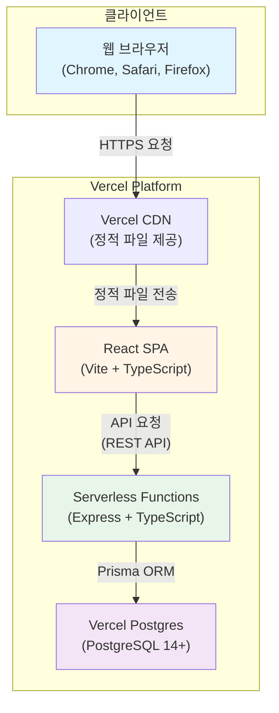

### 1.2 레이어 구조

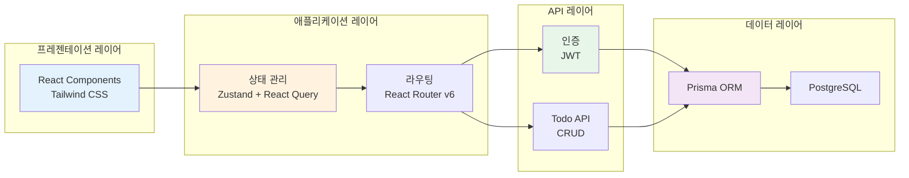

---

## 2. 기술 스택

### 2.1 프론트엔드

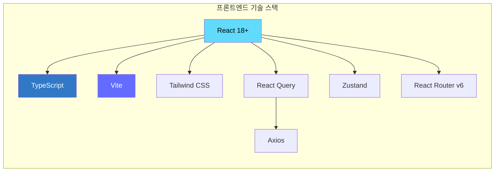

### 2.2 백엔드

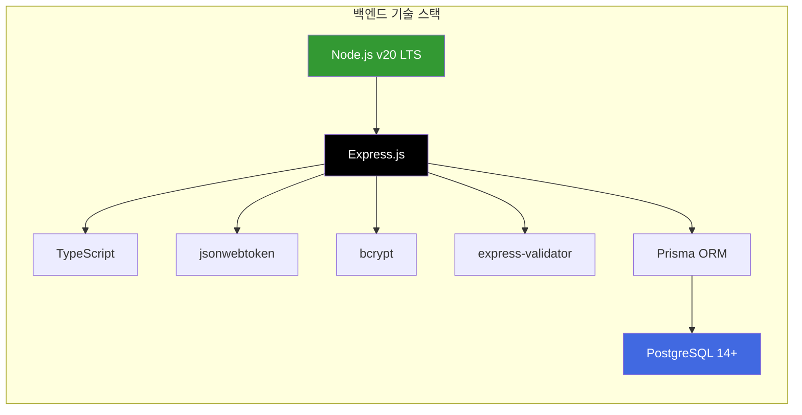

---

## 3. API 구조

### 3.1 API 엔드포인트

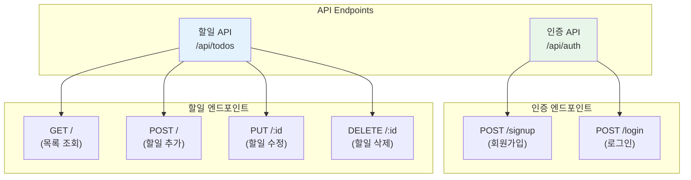

### 3.2 요청/응답 플로우

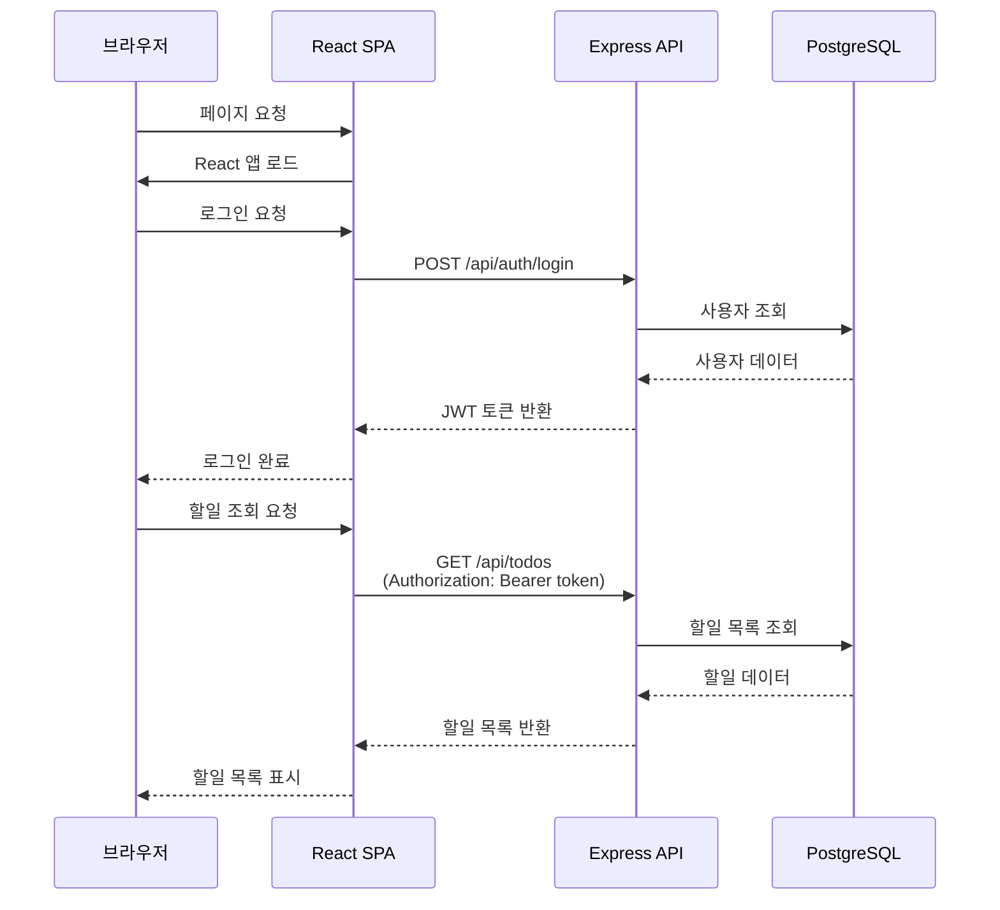

---

## 4. 데이터베이스 스키마

### 4.1 ERD (Entity Relationship Diagram)

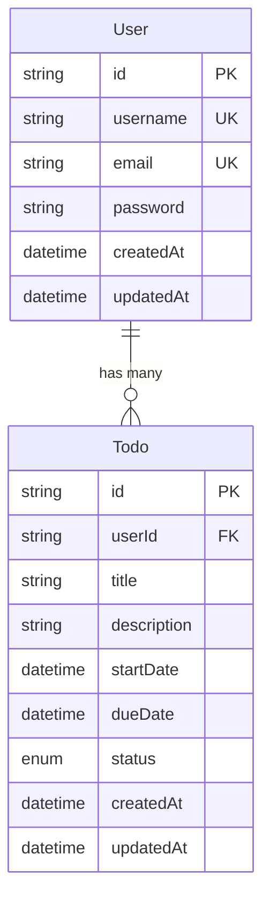

### 4.2 테이블 관계

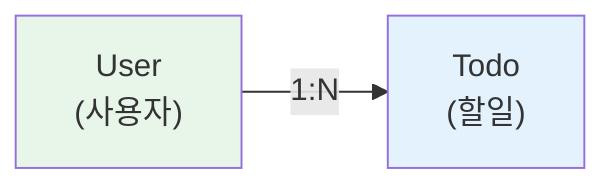

---

## 5. 인증 플로우

### 5.1 회원가입 플로우

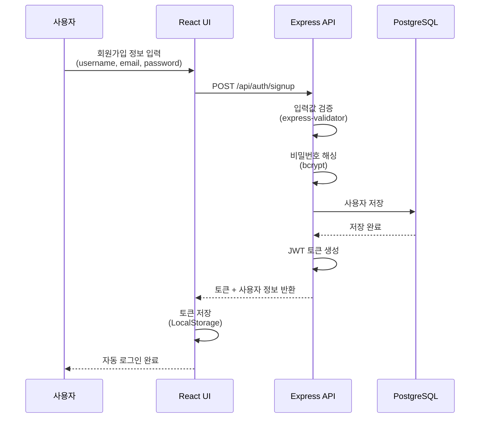

### 5.2 로그인 플로우

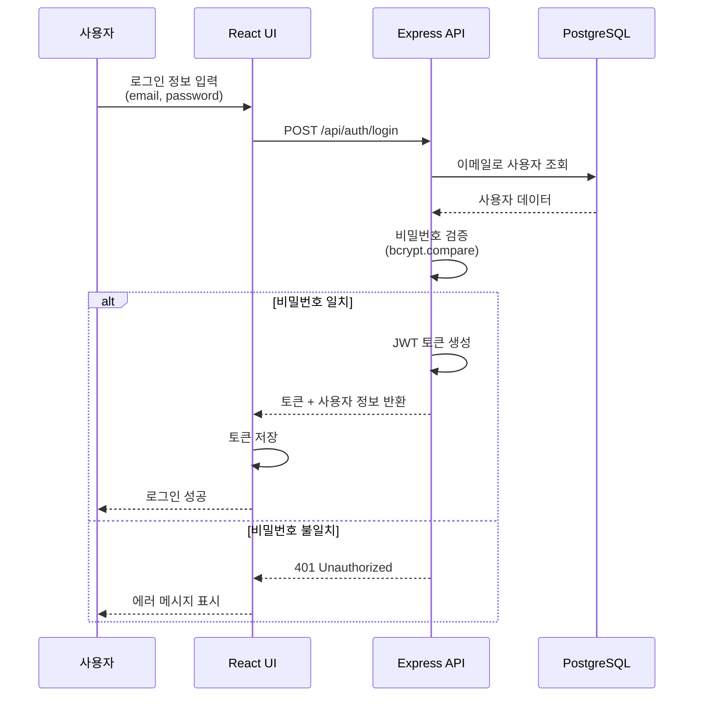

### 5.3 인증 미들웨어

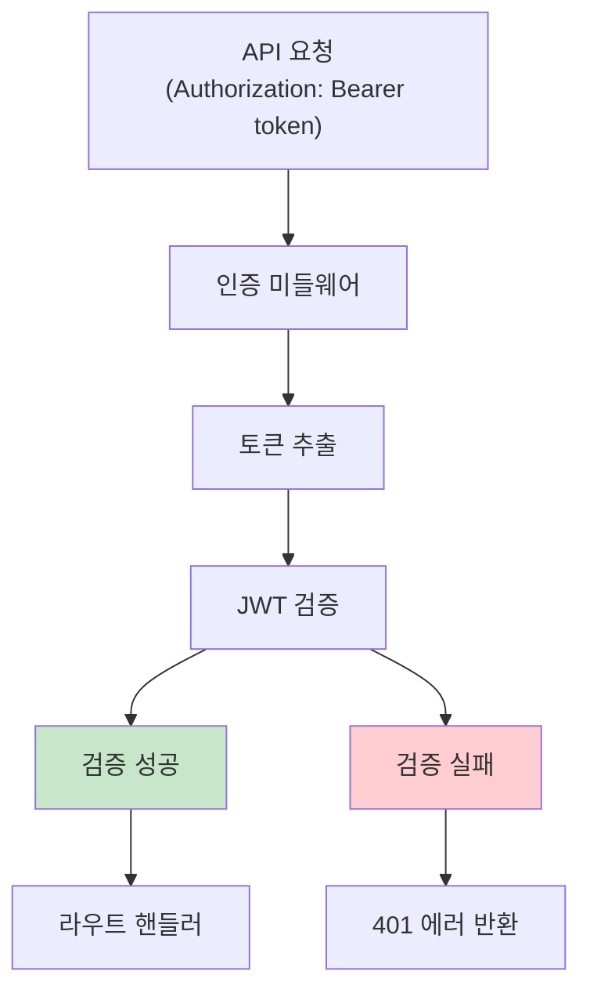

---

## 배포 구조

### Vercel 배포 플로우

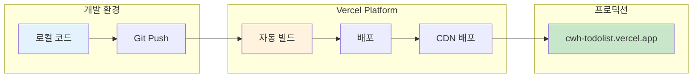

---

## 참조 문서

- [PRD (Product Requirements Document)](./3-prd.md) - 섹션 8 기술적 고려사항
- [도메인 정의서](./1-domain-definition.md) - 엔티티 및 데이터 모델

---

**문서 버전**: 1.0
**최종 업데이트**: 2025-11-26
**작성자**: Claude

---

**End of Document**
